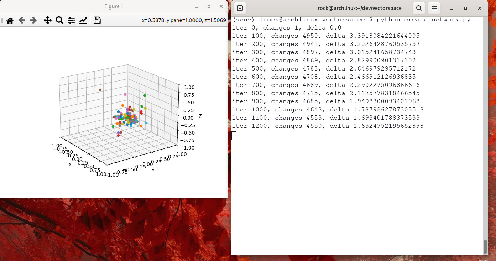

## Rock's relative vector spaces

An attempt at scaling cognitive vector in lower dimensional spaces and exploring kissing numbers.  This little code experiment takes GPT-2's 768 dimensional vectors lowers their dimensionality to 8.

- Given 50,257 semantic vectors (GPT-2), each of dimension 768, find their relative distances
- Given 50,257 concepts with relative distances:
  - put each vector randomly into an n-dimension space (n=8)
  - using a small step "learning rate" move each vector a little bit each time to re-create their required distances
    in order to re-create the distances of the original vector set

*todo*: lots 
- rewrite the code in Rust or C so that it performs better, maybe even using a GPU.
- if 768 dimensions represent an absolute encoding in terms of semantics, then the lower set of dimensions represents a relative encoding between the vectors.  Information is lost, but - we've got a smaller vector space, if possible, we retain "relative" meaning and continuous meaning through the vector spaces.

